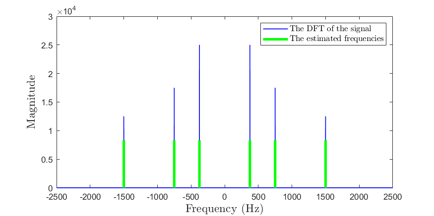
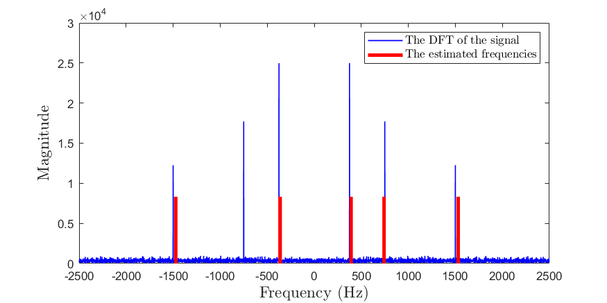

# Improved Annihilating Filter

Aoyu Gong and Ertugrul Gazi Tekden

<div align="center">
<p>

</p>
</div>
<table>
      <tr><td><em>Figure: The PSD of a noisy sinusoidal signal for the case of K = 3.</em></td></tr>
</table>


In this project, we examine the annihilating filter, a parametric method for estimating line spectra. To address the challenge of noise, we further investigate the application of an iterative algorithm as an improved version of the annihilating filter. We perform comprehensive experiments using synthetic and real data to evaluate the performance of the two methods. Furthermore, we assess the robustness of these methods in the presence of noise.


## Configuration

You can reproduce our experiments using **MATLAB R2021a**.

- Clone the repository: `https://github.com/aygong/annihilating-filter.git`

- Run the script: `main_synthetic_data.m` or `main_real_data.m`

> The code may be compatible with the previous versions of MATLAB.


## Demo

### 1 Demo with Synthetic Data

In this section, we present demos using synthetic data.

Set $\omega_1 = 375 \text{ Hz}$, $\omega_2 = 750 \text{ Hz}$, $\omega_3 = 1500 \text{ Hz}$, $\alpha_1 = 10 \text{ V}$, $\alpha_2 = 7 \text{ V}$, and $\alpha_3 = 5 \text{ V}$.

#### 1.1 Clean Synthetic Data

Set `data_mode = 'clean'` and `SNR = Inf`.

- Set `filter_type = 'basic'` and `N = 2 * K + 1`:

  <div align="center">
  <p>
  
  </p>
  </div>

- Set `filter_type = 'improved'` and `N = 2 * K + 1`:

  <div align="center">
  <p>
  
  </p>
  </div>

#### 1.2 Noisy Synthetic Data

Set `data_mode = 'noisy'` and `SNR = 20`.

- Set `filter_type = 'basic'` and `N = 2 * K + 1`:

  <div align="center">
  <p>
  
  </p>
  </div>

- Set `filter_type = 'improved'` and `N = 2 * K + 10`:

  <div align="center">
  <p>
  
  </p>
  </div>

Set `data_mode = 'noisy'` and `SNR = 5`.

- Set `filter_type = 'improved'` and `N = 2 * K + 10`:

  <div align="center">
  <p>
  
  </p>
  </div>

- Set `filter_type = 'improved'` and `N = 2 * K + 100`:

  <div align="center">
  <p>
  
  </p>
  </div>

Set `data_mode = 'noisy'` and `SNR = 2`.

- Set `filter_type = 'improved'` and `N = 2 * K + 10`:

  <div align="center">
  <p>
  
  </p>
  </div>

- Set `filter_type = 'improved'` and `N = 2 * K + 100`:

  <div align="center">
  <p>
  
  </p>
  </div>

### 2 Demo with Real Data

In this section, we present demos using real data.

#### 2.1 Clean Real Data

Set `data_mode = 'clean'` and load data from the WAV file `./data/Clean bass.wav`.

- Set `filter_type = 'basic'` and `N = 2 * K + 1`:

  <div align="center">
  <p>
  
  </p>
  </div>

- Set `filter_type = 'improved'` and `N = 2 * K + 10`:

  <div align="center">
  <p>
  
  </p>
  </div>

- Set `filter_type = 'improved'` and `N = 2 * K + 100`:

  <div align="center">
  <p>
  
  </p>
  </div>

- Set `filter_type = 'improved'` and `N = 2 * K + 1000`:

  <div align="center">
  <p>
  
  </p>
  </div>

#### 2.2 Noisy Real Data

Set `data_mode = 'noisy'` and load data from the WAV file `./data/Noisy bass.wav`.

- Set `filter_type = 'basic'` and `N = 2 * K + 1`:

  <div align="center">
  <p>
  
  </p>
  </div>

- Set `filter_type = 'improved'` and `N = 2 * K + 10`:

  <div align="center">
  <p>
  
  </p>
  </div>

- Set `filter_type = 'improved'` and `N = 2 * K + 100`:

  <div align="center">
  <p>
  
  </p>
  </div>

- Set `filter_type = 'improved'` and `N = 2 * K + 1000`:

  <div align="center">
  <p>
  
  </p>
  </div>


## Folder Structure

```bash
./annihilating-filter/
├── README.md
|
├── data                              # The real data
|   ├── Clean bass.wav                # The clean real data
|   └── Noisy bass.wav                # The noisy real data
|
├── main_synthetic_data.m             # Perform experiments using synthetic data
├── main_real_data.m                  # Perform experiments using real data
├── basic_annihilating_filter.m       # Implement the basic annihilating filter
├── improved_annihilating_filter.m    # Implement the improved annihilating filter
├── hermitian.m                       # Return a Hermitian matrix
├── T_matrix.m                        # Return the Toeplitz matrix T
└── R_matrix.m                        # Return the Toeplitz matrix R
```

